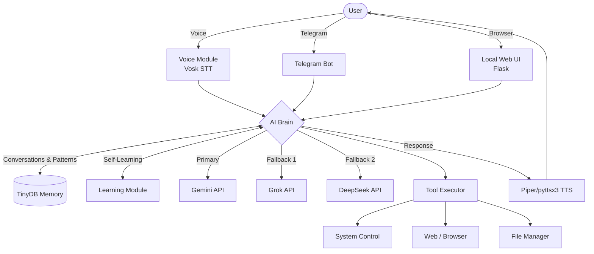

<div align="center">
  
  <h1>🛡️ CLAWVIS: The Neural Knowledge OS</h1>
  <p><strong>Ultra-Lightweight, Proactive, 3-in-1 Personal AI Assistant</strong></p>

  <p>
    <a href="https://github.com/Sarkar009765/MARK-5/blob/master/LICENSE"></a>
    
    
    
  </p>
</div>

<hr>

## 📖 Overview

**ClawVis (MARK-5)** is a highly optimized, context-aware Personal AI Assistant designed specifically to run smoothly on low-end PCs (even those with just 4GB RAM). It acts as your personal "Jarvis," combining Voice Recognition, a Telegram Bot, and a stunning Glassmorphism Web Interface into a single unified system.

Powered by a dynamic multi-LLM architecture (Gemini → Grok → DeepSeek), ClawVis doesn't just wait for commands—it proactively monitors your system, learns from your habits, and assists you in real-time.

## ✨ Key Features

- 🎙️ **Always-On Voice Control:** Hands-free operation with the "Jarvis" wake word.
- 💻 **Stunning Web UI:** A beautiful, responsive, glassmorphism chat interface hosted locally.
- 📱 **Telegram Integration:** Control your PC remotely using the built-in Telegram Bot.
- 🧠 **Dynamic Self-Learning:** Automatically caches good responses and learns from your feedback to become faster and smarter.
- 🛡️ **Multi-LLM Fallback:** Primary processing via Gemini, with automatic fallback to Grok or DeepSeek if the primary API goes down.
- ⚙️ **Real PC Control:** Can open applications, control volume, take screenshots, manage files, and automate browser tasks using Playwright.
- 🔔 **Proactive Notifications:** Monitors high CPU/RAM usage, weather, and disk space, alerting you before issues occur.

---

## 🏗️ System Architecture



---

## 🚀 Getting Started

### Prerequisites
- Windows OS (10/11)
- **Python 3.10** or higher installed.
- **Git** installed.
- A free API key from [Google AI Studio (Gemini)](https://aistudio.google.com).

### Installation Instructions

**1. Clone the Repository:**
```bash
git clone https://github.com/Sarkar009765/MARK-5.git
cd MARK-5
```

**2. Run the Auto-Setup Script:**
This script creates a virtual environment and installs all dependencies (`requirements.txt`).
```cmd
scripts\setup.bat
```

**3. Configure API Keys:**
Open the `.env` file in the project root and add your Gemini API Key:
```ini
GEMINI_API_KEY=your_gemini_api_key_here
# Optional:
TELEGRAM_BOT_TOKEN=your_bot_token
GROK_API_KEY=your_grok_key
DEEPSEEK_API_KEY=your_deepseek_key
```

**4. Download Voice Recognition Model (Crucial for Voice Control):**
Run the downloader script to fetch the lightweight Vosk English model (~40MB).
```cmd
scripts\download_model.bat
```

### Usage

To start ClawVis, simply run:
```cmd
python main.py
```
> **What happens?** The system will initialize the Brain, start listening for "Jarvis", connect the Telegram bot (if configured), and automatically open the **Web UI** in your default browser.

To run ClawVis automatically when Windows starts:
```cmd
scripts\auto_start.bat
```

---

## 🛠️ Command Cheat Sheet

### Voice & Chat Commands
- *"Open notepad"* / *"Close notepad"*
- *"Search for Python tutorials"*
- *"What's the weather in Dhaka?"*
- *"System info"* (Returns CPU/Memory status)
- *"Take a screenshot"*
- *"Volume up/down"*

### Telegram Commands
| Command | Description |
|---------|-------------|
| `/start` | Activate the bot link |
| `/status`| Get current PC system status |
| `/voice` | Trigger voice response on the PC |
| `/sync`  | Sync recent conversation history |

---

## 📁 Directory Structure

```text
MARK-5/
├── brain/               # LLM integration & System Prompts
├── memory/              # TinyDB conversation & pattern storage
├── models/              # Downloaded Vosk & TTS Models
├── scripts/             # Setup, Model Download & Auto-Start scripts
├── templates/           # Web UI Frontend (HTML/CSS/JS)
├── tools/               # Playwright, File, and System automation tools
├── voice/               # Wake-word detection, STT, and TTS
├── web_ui.py            # Flask Server for the local Web GUI
├── main.py              # Application Entry Point
├── .env                 # API Credentials
└── requirements.txt     # Python Dependencies
```

---

## 🤝 Contributing
Contributions, issues, and feature requests are welcome! 
1. Fork the Project
2. Create your Feature Branch (`git checkout -b feature/AmazingFeature`)
3. Commit your Changes (`git commit -m 'Add some AmazingFeature'`)
4. Push to the Branch (`git push origin feature/AmazingFeature`)
5. Open a Pull Request.

## 📝 License
Distributed under the MIT License. See `LICENSE` for more information.

---
<div align="center">
  <b>Developed with ❤️ for the low-end PC community.</b>
</div>